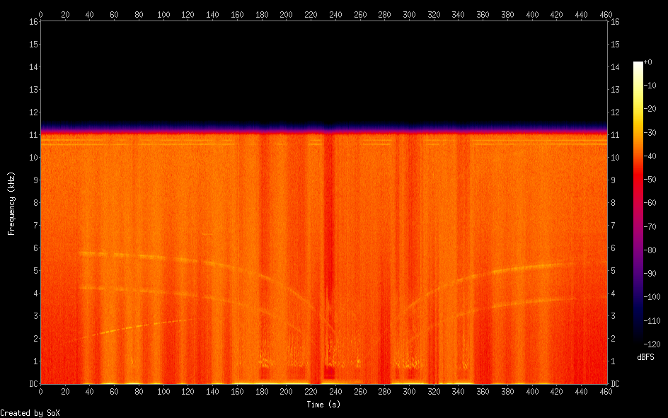
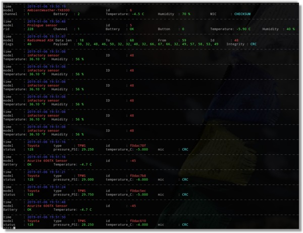
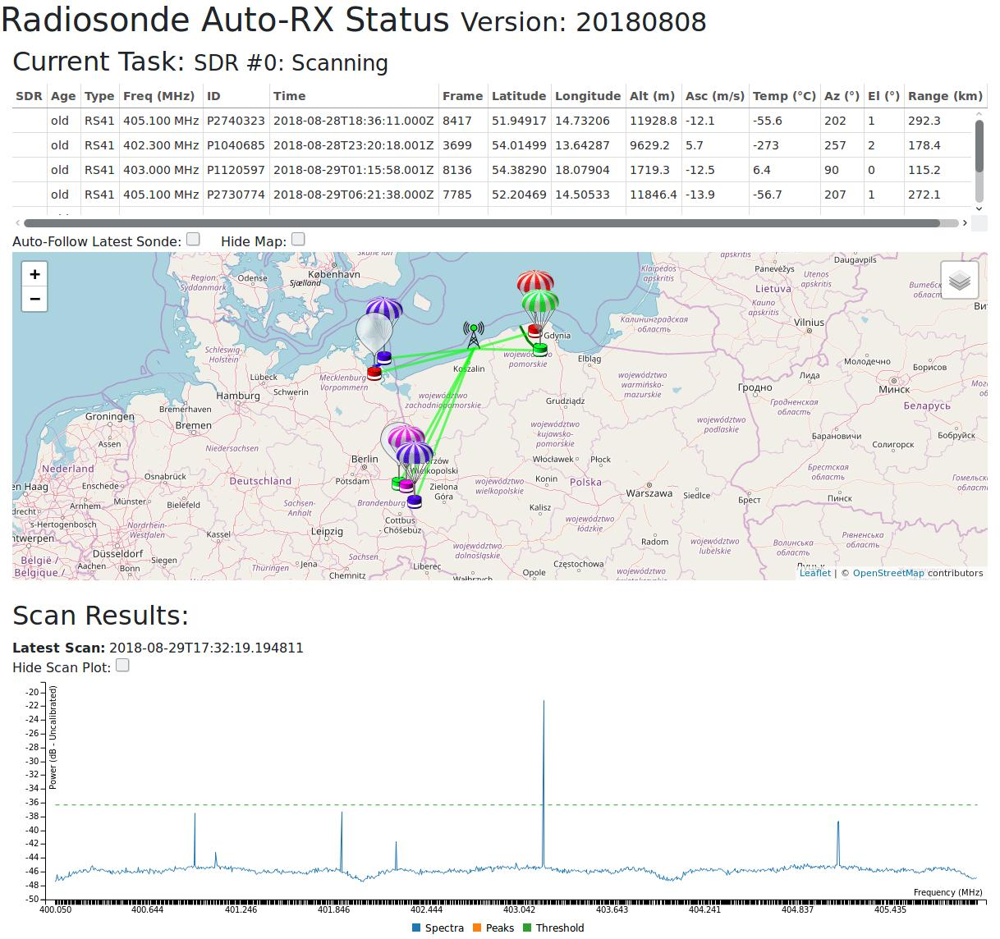
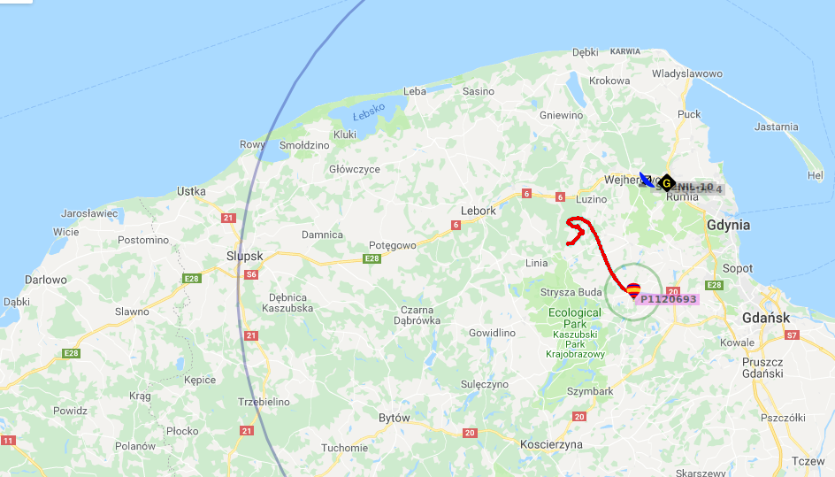
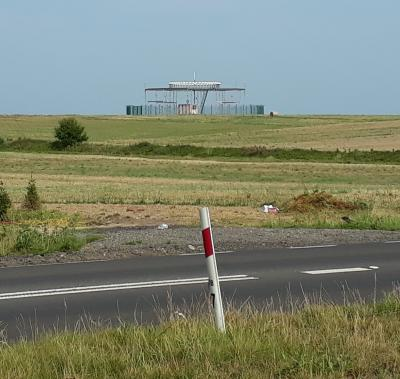

Sygnały do złapania za pomocą RTL-SDR
==============================

Czyli mój album-notatnik nasłuchowca-radio(bardzo)amatora.

> **Nie wymaga pozwolenia używanie urządzeń radiowych przeznaczonych wyłącznie do odbioru.** Ustawa z dnia 16 lipca 2004 r., Prawo telekomunikacyjne (Dz. U. Nr 171, poz.1800) DZIAŁ VI, Rozdział 2, Art. 144. p. 1.

Table of Contents
=================

<!-- TOC depthFrom:1 depthTo:2 withLinks:1 updateOnSave:1 orderedList:0 -->

- [Użyty sprzęt i software](#uyty-sprzt-i-software)
- [Satelity](#satelity)
	- [NOAA :smile:](#noaa-smile)
	- [Meteor :x:](#meteor-x)
	- [FO-29 :smile: :x:](#fo-29-smile-x)
	- [HO-68 :x:](#ho-68-x)
	- [ISS :smile: :x:](#iss-smile-x)
	- [GPS :x:](#gps-x)
	- [Iridium :x:](#iridium-x)
	- [PRATHAM :x:](#pratham-x)
	- [Fox-01 == AO-85 :x:](#fox-01-ao-85-x)
	- [Fox-1B :smile:](#fox-1b-smile)
	- [SO-50](#so-50)
- [Naziemne](#naziemne)
	- [Radiofax :x:](#radiofax-x)
	- [Stacje pogodowe i inne czujniki na 433 MHz :smile:](#stacje-pogodowe-i-inne-czujniki-na-433-mhz-smile)
	- [LoRa WAN :x:](#lora-wan-x)
	- [POCSAG :x:](#pocsag-x)
	- [STQC :x:](#stqc-x)
- [Nawodne](#nawodne)
	- [AIS :smile:](#ais-smile)
- [Audio](#audio)
	- [Nasłuch](#nasuch)
	- [Tetra :smile:](#tetra-smile)
	- [D-STAR, NXDN4800, NXDN9600, DMR/MotoTRBO, P25 Phase 1, X2-TDMA](#d-star-nxdn4800-nxdn9600-dmrmototrbo-p25-phase-1-x2-tdma)
	- [PSK31, 62 :x:](#psk31-62-x)
	- [DECT :x:](#dect-x)
- [Samoloty i inne latające](#samoloty-i-inne-latajce)
	- [Sondy meteorologiczne :smile:](#sondy-meteorologiczne-smile)
	- [ADS-B :smile:](#ads-b-smile)
	- [VHF Data Link mode 2 (VDL2) :smile:](#vhf-data-link-mode-2-vdl2-smile)
	- [ACARS :smile:](#acars-smile)
	- [FLARM :x:](#flarm-x)
	- [VOR :smile:](#vor-smile)
- [Inne](#inne)
	- [AFSK1200 :smile:](#afsk1200-smile)
	- [APRS na CB :x:](#aprs-na-cb-x)
	- [APRS przez satelitę :x:](#aprs-przez-satelit-x)
	- [SSTV](#sstv)
- [Przydatny software](#przydatny-software)
	- [pomiar ppm](#pomiar-ppm)
	- [Skanowanie częstotliwości](#skanowanie-czstotliwoci)
	- [Inne](#inne)
- [Ciekawe do rozkminienia](#ciekawe-do-rozkminienia)

<!-- /TOC -->


# Użyty sprzęt i software

- Lokalizacja: Warszawa, QTH locator: [KO02MD54](http://ostol.pl/mapa-qth-lokatorow?qth=KO02MD&from=&t=roadmap)
- DVB-T dongle: Rafael Micro R820T tuner aka Realtek Semiconductor Corp. RTL2838 DVB-T
- antena szerokopasmowa Magnum Scan Stick 2000
- Linux Mint
- `gqrx` (audio, satelity NOAA...)
  - przesyłanie dźwięku przez UDP, dekodowanie dowolnym innym programem, np: `socat stdout udp-listen:7355 | dsd -i - -w dsd_output.wav`
- `rtl_fm`
- `multimon-ng` - wersja sq5bpf: https://github.com/sq5bpf/multimon-ng-stqc
- do automatycznego nagrywania i procesowania sygnałów satelitarnych (a także wszelkich innych) polecam program do a[utomatycznego nagrywania - autowx2](https://github.com/filipsPL/autowx2/) mojego autorstwa (python/linux)

# Satelity

## NOAA :smile:

- software: `gqrx`, `xwxtoimg`
- alternatywnie: `rtl_fm` wraz ze skryptami https://github.com/DrPaulBrewer/rtlsdr-automated-wxsat-capture - na razie trochę gorsze wyniki niż gqrx ([tutaj próbka](https://github.com/filipsPL/signals/tree/master/sat/noaa/rtl_fm/))

Wyniki:


## Meteor :x:

- chyba dość trudne, trzeba mieć specjalną/dobrą antenę (?)

## FO-29 :smile: :x:

- https://dolske.wordpress.com/2014/04/21/satellite-radio/
- decoding: http://www.dxatlas.com/cwskimmer/ :x:

- udało się bez dekodowania: Mode: USB / CW-L, było słychać morsa (?). f=435,795 MHz (sterowane przez gpredict) (Mode U CW Beacon)


to te mizerne punkty po środku widma...

## HO-68 :x:

- https://dolske.wordpress.com/2014/04/21/satellite-radio/
- nadaje morsem
- jak na razie bez sukcesu

## ISS :smile: :x:

- http://www.rtl-sdr.com/receiving-iss-data-comms-rtl-sdr/
- f = 145.825 143.625 143.635
- Voice and SSTV transmissions take place on 145.800 MHz FM, the AX.25 packet may be heard on 437.550 MHz. (https://amsat-uk.org/beginners/how-to-hear-the-iss/)

### Voice :smile:

- złapana z pomocą [automatycznej stacji nagrywającej autowx2](https://github.com/filipsPL/autowx2/) w jadącym samochodzie z anteną na dachu ;-)
- fragment (kilka s) rozmowy po rosyjsku. To prawdopodobnie jeden z dwóch obecnych na stacji rosjan: Commander Alexander Misurkin lub Anton Shkaplerov
- [mp3](sat/ISS/20180218-1144_ISS.mp3) - 202kb
- spektrogram audio (`sox`):


## GPS :x:

- potrzebna antena (5 USD)
- http://www.rtl-sdr.com/rtl-sdr-tutorial-gps-decoding-plotting/

## Iridium :x:

- A set of tools to parse Iridium frames https://github.com/muccc/iridium-toolkit (?)

## PRATHAM :x:

> a sign from PRATHAM on 145.980. The signals are weak but you can decode the signals. Now lets try to received the AFSK 1200 signals when the satellite is over there second ground-station in France.

- http://www.pe0sat.vgnet.nl/2016/a-sign-from-pratham/
- f = 145.980 MHz
- na razie bez sukcesu

## Fox-01 == AO-85 :x:

- https://amsat-uk.org/satellites/communications/ao-85-fox-1a/
- current status: http://www.amsat.org/tlm/health.php?id=1&port=
- 145.978 MHz (+/- 3 kHz Doppler shift) FM Downlink - nie ma w gpredict! (?)

## Fox-1B :smile:

- Fox-1B, AO-91 or AMSAT OSCAR 91
- 145.960 MHz downlink FM
- https://en.wikipedia.org/wiki/Fox-1B



[mp3](sat/FOX-1B/20180827-1226_FOX-1B.mp3)


## SO-50

- 436.795 MHz downlink; http://www.amsat.org/?page_id=1015
- złapany, ale nic nie mogłem zrozumieć albo zdekodować.


# Naziemne


## Radiofax :x:

> Radiofax, also known as weatherfax (portmanteau word from the words "weather facsimile") and HF fax (due to its common use in the short waves), is an analogue mode for transmitting monochrome images. It was the predecessor to slow-scan television (SSTV). Prior to the advent of the commercial telephone line "fax" machine, it was known, more traditionally, by the term "radiofacsimile". The cover of the regular NOAA publication on frequencies and schedules states "Worldwide Marine Radiofacsimile Broadcast Schedules". [wikipedia](https://en.wikipedia.org/wiki/Radiofax)

- odbiornik UKF/KF ?
- Soft: http://www.w1hkj.com/ ? http://www.hffax.de/html/software.htm ?
- http://59nord.pl/grib-dla-norwegii/
- software: http://arachnoid.com/python/weatherreader/
- https://ranous.wordpress.com/2015/07/03/how-to-receive-marine-radiofax-charts/

## Stacje pogodowe i inne czujniki na 433 MHz :smile:

- `rtl_433`: https://github.com/merbanan/rtl_433



co ciekawe, można złapać nie tylko typowe stacje pogodowe:

```
time      : 2019-01-06 19:50:19
model     : AmbientWeather-TX8300                  id        : 6
channel   : 1            Battery   : 2             Temperature: -4.5 C       Humidity  : 70 %          MIC       : CHECKSUM
```

ale i np czujniki samochodowe (z kół):

```
time      : 2019-01-06 19:53:24
model     : Toyota       type      : TPMS          id        : xxxxxx
status    : 128          pressure_PSI: 28.250      temperature_C: -5.000     mic       : CRC
```

## LoRa WAN :x:

- [howto](https://www.radiojitter.com/decoding-of-lorawan-packets/)

## POCSAG :x:

- pagery
- http://www.sigidwiki.com/wiki/POCSAG
> 47.000 MHz - 47.250 MHz 	European Union Standardized
> 169.400 MHz - 169.800 MHz 	European Union Standardized
> Warszawa, 468.3375. Częstota ta należy do MetroBipu (system 2, z Marriotta)

- f=139987500 ?, 468337500 ?
- f=469150000 - centrum onkologii Warszawa
- `rtl_fm -g 49.6 -f 469150000 -s 22050 -o 4 -p 61 | multimon-ng -t raw -a POCSAG512 -a POCSAG1200 -a POCSAG2400 -f alpha -`

```
POCSAG512: Address:    2468  Function: 0
POCSAG512: Numeric: 3046
POCSAG512: Alpha: <ETX>H
POCSAG512: Address:    2468  Function: 0

POCSAG1200: Address:  102264  Function: 2
POCSAG512: Address: 2023536  Function: 3
POCSAG512: Alpha: /ä<CORRUPT>
POCSAG2400: Address: 1104760  Function: 1
POCSAG512: Address: <CORRUPT>  Function: <CORRUPT>
POCSAG512: Alpha: +<ENQ>
POCSAG512: Address:    2456  Function: 0
POCSAG512: Address: 1051041  Function: 3
POCSAG512: Address: 2001520  Function: 2
POCSAG2400: Address: <CORRUPT>  Function: <CORRUPT>
POCSAG2400: Alpha: e1
POCSAG2400: Address:  103320  Function: 2
POCSAG1200: Address: <CORRUPT>  Function: <CORRUPT>
POCSAG1200: Alpha: /<VT>
POCSAG1200: Address: 1565672  Function: 1
POCSAG1200: Address: 1419592  Function: 2
POCSAG2400: Address: 2011192  Function: 1
```


## STQC :x:

- Polish standard used mostly by firefighters
- Soft: https://github.com/sq5bpf/multimon-ng-stqc
- Readme: https://github.com/sq5bpf/multimon-ng-stqc/blob/master/README_STQC

> częstotliwość nadawcza TX 148.725 kanał 6, odiorcza RX 148.825 kanał 14.
> 148,8250 MHz to częstotliwość Rx dla syren OSP. 148,7250 MHz to z kolei częstotliwość Tx dla syren OSP.
> Żeby wychwycić kanał wojewódzki, powiatowy i inne kanały pasma PSP musisz skanować zakres 148,6500- 149,3500 MHz.

# Nawodne

## AIS :smile:

AIS stands for Automatic Identification System, and is used in the marine industry to broadcast vessel GPS coordinates to one another to work as a collision avoidance radar system.
- https://www.rtl-sdr.com/new-rtl-sdr-software-rtl_ais/
- software: https://github.com/dgiardini/rtl-ais -- **aisdeco2**
- :warning: okolice Darłowa, ok 1km od morza, antena szerokopasmowa na dachu domku.

```
./aisdeco2 --gain 49.6
2018-08-27 22:17:31.571  INFO     AiSDeco2 v.20180430
Found Rafael Micro R820T tuner
[R82XX] PLL not locked!
Supported Gains (dB):  0.0 0.9 1.4 2.7 3.7 7.7 8.7 12.5 14.4 15.7 16.6 19.7 20.7 22.9 25.4 28.0 29.7 32.8 33.8 36.4 37.2 38.6 40.2 42.1 43.4 43.9 44.5 48.0 49.6
Freq: 162.000 MHz
Freq Correction: 0 ppm
Gain: 49.6 dB
2018-08-27 22:17:41.432  INFO     !AIVDM,1,1,,A,402OTP1v:=lAb1;fI0O=COi00@Hj,0*34
2018-08-27 22:17:41.612  INFO     !AIVDM,1,1,,A,402OTq1v:=lAb18b=vO2Ke1000S:,0*6E
2018-08-27 22:17:42.320  INFO     !AIVDM,1,1,,A,D02OTP0dlFfq6DG6EH0o6D0,0*51                                                                                                                         
2018-08-27 22:17:44.986  INFO     !AIVDM,1,1,,A,D02OTq0WLFfq6DG6DlPo6D0,0*26                                                                                                                         
2018-08-27 22:17:51.388  INFO     !AIVDM,1,1,,B,402OTP1v:=lAl1;fI0O=CP100@Na,0*73                                                                                                                    
2018-08-27 22:17:52.809  INFO     !AIVDM,1,1,,B,33q:uN50001;0T8O9SpuJ49d0DjJ,0*51                                                                                                                    
2018-08-27 22:18:01.520  INFO     !AIVDM,1,1,,A,402OTP1v:=lB21;fHvO=CPA006Q8,0*2A                                                                                                                    
2018-08-27 22:18:11.654  INFO     !AIVDM,1,1,,B,402OTq1v:=lB<18b=vO2KdQ006Q8,0*57                                                                                                                    
2018-08-27 22:18:12.364  INFO     !AIVDM,1,1,,A,D02OTP1k8Ffp00G6DAdo6D0,0*24                                                                                                                         
2018-08-27 22:18:14.853  INFO     !AIVDM,1,1,,A,D02OTq1ehFfp00G6Erlo6D0,0*61                                                                                                                         
2018-08-27 22:18:21.610  INFO     !AIVDM,1,1,,A,402OTq1v:=lBF18b=vO2KdA00<0K,0*26                                                                                                                    
2018-08-27 22:18:25.699  INFO     !AIVDM,1,1,,B,D02OTq1clFfp00G6D7po6D0,0*38                                                                                                                         
2018-08-27 22:18:25.876  INFO     !AIVDM,1,1,,B,33@UCN50001;3dFO94F18Tpl0Cm:,0*42                                                                                                                    
2018-08-27 22:18:27.652  INFO     !AIVDM,1,1,,B,D02OTP1W4Ffp00G6EFpo6D0,0*05
2018-08-27 22:18:31.564  INFO     !AIVDM,1,1,,B,402OTP1v:=lBP1;fHtO=CPQ00D0F,0*34
2018-08-27 22:18:31.741  INFO     !AIVDM,1,1,,B,402OTq1v:=lBP18b=vO2KdA000S:,0*2D
2018-08-27 22:18:41.519  INFO     !AIVDM,1,1,,A,402OTP1v:=lBb1;fHtO=CPQ00<0F,0*7D
2018-08-27 22:18:41.697  INFO     !AIVDM,1,1,,A,402OTq1v:=lBb18b=vO2Kd100D0M,0*0C
2018-08-27 22:18:42.409  INFO     !AIVDM,1,1,,A,D02OTP0dlFfq6DG6EH0o6D0,0*51
2018-08-27 22:18:44.897  INFO     !AIVDM,1,1,,A,D02OTq0WLFfq6DG6DlPo6D0,0*26
2018-08-27 22:18:55.741  INFO     !AIVDM,1,1,,B,D02OTq0UPFfq6DG6E><o6D0,0*04
2018-08-27 22:19:01.785  INFO     !AIVDM,1,1,,A,402OTq1v:=lC218b=tO2Kd10081M,0*22
2018-08-27 22:19:02.498  INFO     !AIVDM,1,1,,A,B3q5KT000HBh?k7jHWQp?wQUoP06,0*1C
2018-08-27 22:19:11.565  INFO     !AIVDM,1,1,,B,402OTP1v:=lC<1;fI0O=CPQ00<0E,0*67
2018-08-27 22:19:11.741  INFO     !AIVDM,1,1,,B,402OTq1v:=lC<18b=rO2Kd1000S:,0*34
2018-08-27 22:19:12.451  INFO     !AIVDM,1,1,,A,D02OTP1k8Ffp00G6DAdo6D0,0*24
2018-08-27 22:19:21.519  INFO     !AIVDM,1,1,,A,402OTP1v:=lCF1;fI2O=CPQ000S:,0*0C
2018-08-27 22:19:31.474  INFO     !AIVDM,1,1,,B,402OTP1v:=lCP1;fI2O=CPQ00@Bs,0*31
2018-08-27 22:19:35.741  INFO     !AIVDM,1,1,,A,B3ptOn000@Bh?k7jHiKNSwj5kP06,0*43
2018-08-27 22:19:41.430  INFO     !AIVDM,1,1,,A,402OTP1v:=lCb1;fI2O=CPi008Hj,0*53
2018-08-27 22:19:41.785  INFO     !AIVDM,1,1,,A,402OTq1v:=lCb18b=nO2Kdi00@Hq,0*0D
2018-08-27 22:19:42.321  INFO     !AIVDM,1,1,,A,D02OTP0dlFfq6DG6EH0o6D0,0*51
2018-08-27 22:19:44.808  INFO     !AIVDM,1,1,,A,D02OTq0WLFfq6DG6DlPo6D0,0*26
2018-08-27 22:19:51.563  INFO     !AIVDM,1,1,,B,402OTP1v:=lCl1;fI2O=CPQ008Na,0*6B
2018-08-27 22:19:55.653  INFO     !AIVDM,1,1,,B,D02OTq0UPFfq6DG6E><o6D0,0*04
2018-08-27 22:19:57.432  INFO     !AIVDM,1,1,,B,D02OTP0PhFfq6DG6D@To6D0,0*0F
2018-08-27 22:20:01.518  INFO     !AIVDM,1,1,,A,402OTP1v:=lD21;fI0O=CPQ00H1F,0*1B
2018-08-27 22:20:01.696  INFO     !AIVDM,1,1,,A,402OTq1v:=lD218b=lO2KeA006Q@,0*2F
2018-08-27 22:20:14.851  INFO     !AIVDM,1,1,,A,D02OTq1ehFfp00G6Erlo6D0,0*61
2018-08-27 22:20:21.431  INFO     !AIVDM,1,1,,A,402OTP1v:=lDF1;fHvO=CP100D0E,0*46
2018-08-27 22:20:25.696  INFO     !AIVDM,1,1,,B,D02OTq1clFfp00G6D7po6D0,0*38
2018-08-27 22:20:30.673  INFO     !AIVDM,2,1,5,A,53q:uN427nee=0g;;?0JuJ0dtjo7;2222222221J0pG4440Ht7Rkk3hT,0*1C
2018-08-27 22:20:30.673  INFO     !AIVDM,2,2,5,A,VQAp88888888880,2*17
2018-08-27 22:20:41.519  INFO     !AIVDM,1,1,,A,402OTP1v:=lDb1;fHpO=CP1006Q@,0*72
2018-08-27 22:20:41.696  INFO     !AIVDM,1,1,,A,402OTq1v:=lDb18b=lO2Kei00<0M,0*31
2018-08-27 22:20:42.407  INFO     !AIVDM,1,1,,A,D02OTP0dlFfq6DG6EH0o6D0,0*51
2018-08-27 22:20:44.896  INFO     !AIVDM,1,1,,A,D02OTq0WLFfq6DG6DlPo6D0,0*26
2018-08-27 22:20:51.475  INFO     !AIVDM,1,1,,B,402OTP1v:=lDl1;fHnO=CP1006Q@,0*61
2018-08-27 22:20:51.651  INFO     !AIVDM,1,1,,B,402OTq1v:=lDl18b=lO2Kei000S:,0*24
2018-08-27 22:21:11.561  INFO     !AIVDM,1,1,,B,402OTP1v:=lE<1;fHnO=CP1006QD,0*34
2018-08-27 22:21:12.274  INFO     !AIVDM,1,1,,A,D02OTP1k8Ffp00G6DAdo6D0,0*24
2018-08-27 22:21:21.519  INFO     !AIVDM,1,1,,A,402OTP1v:=lEF1;fHnO=CP100@=4,0*27
2018-08-27 22:21:21.695  INFO     !AIVDM,1,1,,A,402OTq1v:=lEF18b=nO2KeQ000S:,0*36
2018-08-27 22:21:21.873  INFO     !AIVDM,1,1,,B,H3ptOn1<tIDr0TV222222222220,0*4D
2018-08-27 22:21:22.050  INFO     !AIVDM,1,1,,B,H3ptOn4T1=3PPPPC@Ckloi102120,0*65
```

**TODO**: Wizualizacja dekodowanych wiadomości i naniesienie pozycji statków na mapę :memo: :lemon:

# Audio

## Nasłuch

### Pogotowie Ratunkowe Warszawa :smile:

- software used: `gqrx`, mode: Narrow FM, f = 168523800 Hz
- rtl_sdr: `rtl_fm -p 61 -M fm -s 170k -o 4 -A fast -r 32k -l 40 -E deemp -f 168523800  | play -r 32k -t raw -e s -b 16 -c 1 -V1 -`

### Okęcie Informacje o stanie pasa :smile:

- `gqrx`: f=120450600 Hz, AM

### Wieża Warszawa Okęcie (OKE) :smile:

- `gqrx`: f=118299200 Hz, AM

### Kontrola płyty OKE Warszawa :smile:

- `gqrx`: f=121599300 Hz, AM

### VOLMET - stan pogody dla europejskich portów lotniczych :smile:

- `gqrx`: f=127599900 Hz, AM

### Polska ACC TRZ / Warszawa Radar civ :smile:

- `gqrx`: f=134874900 Hz, AM

### CB-Radio :smile:

```
Częstotliwości kanałów CB :

kanał            częstotliwość (MHz)                kanał                częstotliwość (MHz)
1                     26.960                                  21                     27.210
2                     26.970                                  22                     27.220
3                     26.980                                  23                     27.250
4                     27.000                                  24                     27.230
5                     27.210                                  25                     27.240
6                     27.020                                  26                     27.260
7                     27.030                                  27                     27.270
8                     27.050                                  28                     27.280
9                     27.060                                  29                     27.290
10                   27.070                                  30                     27.300
11                   27.080                                  31                     27.310
12                   27.100                                  32                     27.320
13                   27.110                                  33                     27.330
14                   27.120                                  34                     27.340
15                   27.130                                  35                     27.350
16                   27.150                                  36                     27.360
17                   27.160                                  37                     27.370
18                   27.170                                  38                     27.380
19                   27.180                                  39                     27.390
20                   27.200                                  40                     27.400
```
> AM (modulacja amplitudy) najbardziej popularna modulacja, stosowana w Polsce (i innych krajach tez) , obowiązuje na podstawowej czrterdziestce, ponieważ
praktycznie wszystkie radia CB mają ten rodzaj modulacji; moga mieć też inne, ale zawsze mają AM.

Za: http://radioamator.elektroda.eu/poradycb.html

## Tetra :smile:

- Software: https://github.com/sq5bpf/telive
- Mój skrypt do uruchomienia telive (jeden skrypt, otwiera wszystkie okienka, 6 kanałów, bez gnuradio): [link](https://raw.githubusercontent.com/filipsPL/signals/master/ground/TETRA/runtetra.sh) [link](https://raw.githubusercontent.com/filipsPL/signals/master/ground/TETRA/runtetra.sh)
- plik z częstotliwościami - Warszawa:[link](https://raw.githubusercontent.com/filipsPL/signals/master/ground/TETRA/telive_frequency_report.txt)


## D-STAR, NXDN4800, NXDN9600, DMR/MotoTRBO, P25 Phase 1, X2-TDMA

- http://www.rtl-sdr.com/tag/mototrbo/ - pod windowsa :-(
- DSD: linux: https://github.com/szechyjs/dsd/wiki
 - opis kompilacj i instalacji pod Ubuntu - działa super: https://www.george-smart.co.uk/scrapbook/digital_speech_decoder/
 - ogólna komenda: `rtl_fm -f 139987500 -s 22050 -o 4 -p 61 | dsd -i - -w dsd_output.wav`
 - lub nasłuchując przez UDP danych z gqrx: `socat stdout udp-listen:7355 | dsd -i - -w dsd_output.wav`
 - rozmowy głosowe są szyfrowane/kodowane, więc to co można nasłuchać to raczej bezładne dźwięki


### X2-TDMA :smile:

- `rtl_fm -f 139987500 -s 22050 -o 4 -p 61 | dsd -i - -w dsd_output.wav`

```
Sync:  -X2-TDMA   mod: QPSK inlvl: 78% src:        0 tg:     0  slot0  [slot1]  MBC          
Sync:  -X2-TDMA   mod: QPSK inlvl: 104% src:        0 tg:     0  slot0  [SLOT1]  VOICE e:========R=======R========R================R=======R======R
Sync: (-X2-TDMA)  mod: QPSK inlvl: 153% src:        0 tg:     0  slot0  [slot1]  VOICE e:====R========================R====R====R====RM=====R====R====
Sync:  -X2-TDMA   mod: QPSK inlvl: 86% src:        0 tg:     0  slot0  [slot1]  MBC
Sync:  -X2-TDMA   mod: QPSK inlvl: 137% src:        0 tg:     0  slot0  [SLOT1]  VOICE e:========R=====R======R=====R====E=========R====R=========R
Sync: (-X2-TDMA)  mod: QPSK inlvl: 130% src:        0 tg:     0 [slot0]  SLOT1   VOICE e:====R========================E======================R
```

### NXDN96 :smile:

- `rtl_fm -f 139987500 -s 22050 -o 4 -p 61 | dsd -i - -w dsd_output.wav`

```
Sync:  +NXDN96    mod: GFSK inlvl: 48% VOICE e:========T
Sync: no sync
Sync:  -NXDN96    mod: QPSK inlvl: 41% DATA    
Sync: no sync
Sync:  +NXDN96    mod: QPSK inlvl: 33% DATA    
Sync: no sync
Sync:  +NXDN96    mod: GFSK inlvl: 42% VOICE e:========
```

### D-STAR :x:

### DMR/MotoTRBO :smile:

```
Sync:  +DMR       mod: QPSK inlvl: 108%  slot0  [SLOT1]  VOICE e:=========R====R====R===E====R====R======R=====RM============R======
Sync: (+DMR)      mod: C4FM inlvl: 65%  slot0  [slot1]  VOICE e:====R=====R===========R==========R=======R==========R====
Sync:  +DMR       mod: QPSK inlvl: 127%  slot0  [SLOT1]  VOICE e:===E============================R=========
Sync: (+DMR)      mod: GFSK inlvl: 68% [slot0]  slot1   VOICE e:=====R======R=======E=============R====================T
Sync:  +DMR       mod: QPSK inlvl: 65% [SLOT0]  slot1   VOICE e:==========R==================R==========R====R=
Sync: (+DMR)      mod: GFSK inlvl: 58% [SLOT0]  slot1   VOICE e:=========R====R============R===E===============T=E===
Sync: no sync
Sync:  +DMR       mod: QPSK inlvl: 114% [SLOT0]  slot1   VOICE e:===============R===========E==================R
Sync: (+DMR)      mod: C4FM inlvl: 70%  slot0  [slot1]  VOICE e:====R========R=======R==========R======R=====R===E====
Sync: no sync
Sync:  +DMR       mod: QPSK inlvl: 73%  slot0  [SLOT1]  VOICE e:====================R==============R===========R
Sync: (+DMR)      mod: GFSK inlvl: 43% [slot0]  SLOT1   VOICE e:====R======R====R=======R=========================T====R====
```

### P25 Phase 1 :smile:

- gqrx f = 167187100 i streaming przez UDP: `socat stdout udp-listen:7355 | dsd -i - -w dsd_output.wav`

```
Sync:  +P25p1     mod: GFSK inlvl:  9% nac:  2F0 src:        0 tg:     0  PDU
Sync:  +P25p1     mod: C4FM inlvl:  8% nac:  2F0 src:        0 tg:     0  TSDU
Sync:  +P25p1     mod: GFSK inlvl:  8% nac:  2F0 src:        0 tg:     0  TSDU
Sync:  +P25p1     mod: GFSK inlvl:  8% nac:  2F0 src:        0 tg:     0  PDU
Sync:  +P25p1     mod: GFSK inlvl:  6% nac:  2F0 src:        0 tg:     0  TSDU
Sync:  +P25p1     mod: QPSK inlvl: 10% nac:  2F0 src:        0 tg:     0  TSDU
Sync:  +P25p1     mod: QPSK inlvl: 10% nac:  2F0 src:        0 tg:     0  PDU
Sync:  +P25p1     mod: C4FM inlvl:  8% nac:  2F0 src:        0 tg:     0  PDU
Sync:  +P25p1     mod: C4FM inlvl:  6% nac:  2F0 src:        0 tg:     0  TSDU
Sync:  +P25p1     mod: GFSK inlvl:  7% nac:  2F0 src:        0 tg:     0  TSDU
Sync:  +P25p1     mod: GFSK inlvl:  8% nac:  2F0 src:        0 tg:     0  PDU
Sync:  +P25p1     mod: QPSK inlvl: 11% nac:  8F8 src:        0 tg:     0  (PDU)
Sync:  +P25p1     mod: QPSK inlvl: 10% nac:  2F0 src:        0 tg:     0  TSDU

Sync:  -P25p1     mod: QPSK inlvl: 172% nac:  FFC src:        0 tg:     0  duid:EE *Unknown DUID*
Sync:  +P25p1     mod: QPSK inlvl: 161% nac:  3B0 src:        0 tg:     0  duid:EE *Unknown DUID*
```

## PSK31, 62 :x:

> łączność za pomocą przesyłanego tekstu (podobnie jak RTTY). Bardzo odporna na zakłócenia. Na jednym „kanale” może pracować kilka stacji (z przesuniętą nieznacznie podnośną) nie zakłócając się wzajemnie. Info dla CB radiowców – jest to także na 27.500USB. Ja preferuję 28.120 MHz– oj dzieje się tam.... Programy - Digipan, WINpsk, MixW, itp.

Pasma UKF: 144,315 MHz (SSB/USB) 144,600 MHz (FM) [wikipedia](https://pl.wikipedia.org/wiki/PSK31)

- soft: https://sourceforge.net/projects/linpsk/
 - psk31lx (jest w repo)
 - fldigi


## DECT :x:

> DECT is an acronym for ‘Digital Enhanced Cordless Telecommunications’, and is the wireless standard used by modern digital cordless phones. In most countries DECT communications take place at 1880 – 1900 MHz, and in the USA at 1920 – 1930 MHz. So in order to receive these frequencies you’ll need an RTL-SDR with an E4000 chip, or some other compatible SDR that can tune this high.

- soft: https://github.com/znuh/re-DECTed
- potrzeba innego czipa z większym zakresem częstotliwości

# Samoloty i inne latające

- nasłuch pasma lotniczego: `rtl_fm -M am -f 118M:137M:25k -s 24k -g 50 -l 35 | play -t raw -r 24k -es -b 16 -c 1 -V1 -` (audio)

## Sondy meteorologiczne :smile:

- W Polsce sondy startują z Wrocławia, Łeby (403.0 Mhz) i Legionowa (404.5 Mhz) dwa razy dziennie około godziny 12 i 24 (wg https://radiosondy.pl/)
- https://radiosondy.info/ - baza odnalezionych sond
- plus: poszukiwanie "zużytej" sondy
- http://www.radiosondy.fora.pl/
- https://www.rtl-sdr.com/receiving-weather-balloon-data-with-rtl-sdr/
- soft:
  - https://github.com/rs1729/RS
  - https://github.com/projecthorus/radiosonde_auto_rx/wiki :ok: :memo: :lemon:
- transmisja: 2018.08.28, okolice Darłowa, ok 1km od morza, antena szerokopasmowa na dachu domku, `radiosonde_auto_rx`

 ```bash
radiosonde_auto_rx/auto_rx $ python auto_rx.py
2018-08-28 09:12:46,116 INFO:Reading configuration file...
2018-08-28 09:12:48,042 INFO:Config - Tested SDR #0 OK
2018-08-28 09:12:48,045 INFO:Started Flask server on http://0.0.0.0:5000
2018-08-28 09:12:48,046 INFO:Telemetry Logger - Started Telemetry Logger Thread.
2018-08-28 09:12:48,048 INFO:APRS-IS - APRS Uploader Started.
2018-08-28 09:12:48,048 INFO:SDR #0 has been allocated to Scanner.
2018-08-28 09:12:49,976 INFO:Scanner #0 - Starting Scanner Thread
2018-08-28 09:12:49,977 INFO:Scanner #0 - Running frequency scan.
^[[B2018-08-28 09:13:20,207 INFO:Scanner #0 - Running frequency scan.
2018-08-28 09:13:50,135 INFO:Scanner #0 - Running frequency scan.

...

2018-08-28 12:26:42,112 INFO:Scanner #0 - Detected peaks on 1 frequencies (MHz): [ 401.57]
2018-08-28 12:26:57,233 INFO:Scanner #0 - Running frequency scan.
2018-08-28 12:27:27,121 INFO:Scanner #0 - Running frequency scan.
2018-08-28 12:27:47,162 INFO:Scanner #0 - Detected peaks on 1 frequencies (MHz): [ 401.57]
2018-08-28 12:28:02,279 INFO:Scanner #0 - Running frequency scan.
2018-08-28 12:28:32,195 INFO:Scanner #0 - Running frequency scan.
2018-08-28 12:29:02,163 INFO:Scanner #0 - Running frequency scan.
2018-08-28 12:29:32,120 INFO:Scanner #0 - Running frequency scan.
2018-08-28 12:29:52,193 INFO:Scanner #0 - Detected peaks on 1 frequencies (MHz): [ 401.57]
2018-08-28 12:30:07,307 INFO:Scanner #0 - Running frequency scan.
2018-08-28 12:30:37,191 INFO:Scanner #0 - Running frequency scan.
2018-08-28 12:30:57,080 INFO:Scanner #0 - Detected peaks on 1 frequencies (MHz): [ 401.57]
2018-08-28 12:31:12,200 INFO:Scanner #0 - Running frequency scan.
2018-08-28 12:31:32,198 INFO:Scanner #0 - Detected peaks on 1 frequencies (MHz): [ 401.57]

...

2018-08-28 14:56:42,706 INFO:Detected new RS41 sonde on 403.000 MHz!
2018-08-28 14:56:42,707 INFO:Halting Scanner to decode detected radiosonde.
2018-08-28 14:56:42,707 INFO:Scanner #0 - Waiting for current scan to finish...
2018-08-28 14:56:52,255 INFO:Scanner #0 - Scanner Thread Closed.
2018-08-28 14:56:52,256 INFO:SDR #0 has been allocated to Decoder (RS41, 403.000 MHz).
2018-08-28 14:56:54,240 INFO:Decoder #0 RS41 403.000 - Starting decoder subprocess.
2018-08-28 14:56:57,502 INFO:Telemetry Logger - Opening new log file: ./log/20180828-125657_P1120693_RS41_403000_sonde.log
2018-08-28 14:57:30,110 INFO:APRS-IS - Uploaded to APRS-IS: ;P1120693 *111111z5431.61N/01805.04EO118/026/A=041244 RS41 Radiosonde 403.000 MHz -15.6m/s http://bit.ly/2Bj4Sfk
2018-08-28 14:58:00,315 INFO:APRS-IS - Uploaded to APRS-IS: ;P1120693 *111111z5431.49N/01805.40EO117/033/A=039926 RS41 Radiosonde 403.000 MHz -10.4m/s http://bit.ly/2Bj4Sfk
2018-08-28 14:58:30,792 INFO:APRS-IS - Uploaded to APRS-IS: ;P1120693 *111111z5431.33N/01805.75EO135/034/A=038546 RS41 Radiosonde 403.000 MHz -16.7m/s http://bit.ly/2Bj4Sfk
2018-08-28 14:59:00,179 INFO:APRS-IS - Uploaded to APRS-IS: ;P1120693 *111111z5431.12N/01806.04EO139/036/A=036988 RS41 Radiosonde 403.000 MHz -16.2m/s http://bit.ly/2Bj4Sfk
2018-08-28 14:59:30,549 INFO:APRS-IS - Uploaded to APRS-IS: ;P1120693 *111111z5430.83N/01806.33EO154/043/A=035477 RS41 Radiosonde 403.000 MHz -15.0m/s http://bit.ly/2Bj4Sfk
2018-08-28 15:00:00,194 INFO:APRS-IS - Uploaded to APRS-IS: ;P1120693 *111111z5430.43N/01806.68EO147/056/A=034054 RS41 Radiosonde 403.000 MHz -13.2m/s http://bit.ly/2Bj4Sfk
2018-08-28 15:00:30,202 INFO:APRS-IS - Uploaded to APRS-IS: ;P1120693 *111111z5430.06N/01807.07EO153/053/A=032720 RS41 Radiosonde 403.000 MHz -13.3m/s http://bit.ly/2Bj4Sfk
2018-08-28 15:01:00,150 INFO:APRS-IS - Uploaded to APRS-IS: ;P1120693 *111111z5429.62N/01807.41EO155/058/A=031417 RS41 Radiosonde 403.000 MHz -12.7m/s http://bit.ly/2Bj4Sfk
2018-08-28 15:01:30,238 INFO:APRS-IS - Uploaded to APRS-IS: ;P1120693 *111111z5429.20N/01807.72EO162/058/A=030193 RS41 Radiosonde 403.000 MHz -12.4m/s http://bit.ly/2Bj4Sfk
2018-08-28 15:02:00,547 INFO:APRS-IS - Uploaded to APRS-IS: ;P1120693 *111111z5428.70N/01807.98EO160/062/A=028979 RS41 Radiosonde 403.000 MHz -12.1m/s http://bit.ly/2Bj4Sfk
2018-08-28 15:02:30,166 INFO:APRS-IS - Uploaded to APRS-IS: ;P1120693 *111111z5428.24N/01808.29EO157/059/A=027858 RS41 Radiosonde 403.000 MHz -11.5m/s http://bit.ly/2Bj4Sfk
2018-08-28 15:03:00,259 INFO:APRS-IS - Uploaded to APRS-IS: ;P1120693 *111111z5427.81N/01808.63EO154/050/A=026716 RS41 Radiosonde 403.000 MHz -10.9m/s http://bit.ly/2Bj4Sfk
2018-08-28 15:03:30,558 INFO:APRS-IS - Uploaded to APRS-IS: ;P1120693 *111111z5427.44N/01808.89EO160/049/A=025731 RS41 Radiosonde 403.000 MHz -9.9m/s http://bit.ly/2Bj4Sfk
2018-08-28 15:04:00,255 INFO:APRS-IS - Uploaded to APRS-IS: ;P1120693 *111111z5427.06N/01809.14EO155/045/A=024629 RS41 Radiosonde 403.000 MHz -9.9m/s http://bit.ly/2Bj4Sfk
2018-08-28 15:04:30,197 INFO:APRS-IS - Uploaded to APRS-IS: ;P1120693 *111111z5426.74N/01809.38EO153/039/A=023526 RS41 Radiosonde 403.000 MHz -11.1m/s http://bit.ly/2Bj4Sfk
2018-08-28 15:05:00,141 INFO:APRS-IS - Uploaded to APRS-IS: ;P1120693 *111111z5426.43N/01809.64EO152/040/A=022364 RS41 Radiosonde 403.000 MHz -11.7m/s http://bit.ly/2Bj4Sfk
2018-08-28 15:05:30,238 INFO:APRS-IS - Uploaded to APRS-IS: ;P1120693 *111111z5426.15N/01809.90EO149/038/A=021283 RS41 Radiosonde 403.000 MHz -12.2m/s http://bit.ly/2Bj4Sfk
2018-08-28 15:06:00,473 INFO:APRS-IS - Uploaded to APRS-IS: ;P1120693 *111111z5425.87N/01810.16EO150/037/A=020104 RS41 Radiosonde 403.000 MHz -12.8m/s http://bit.ly/2Bj4Sfk
2018-08-28 15:06:30,195 INFO:APRS-IS - Uploaded to APRS-IS: ;P1120693 *111111z5425.60N/01810.44EO146/035/A=018949 RS41 Radiosonde 403.000 MHz -11.3m/s http://bit.ly/2Bj4Sfk
2018-08-28 15:07:00,298 INFO:APRS-IS - Uploaded to APRS-IS: ;P1120693 *111111z5425.36N/01810.70EO148/034/A=018037 RS41 Radiosonde 403.000 MHz -9.5m/s http://bit.ly/2Bj4Sfk
2018-08-28 15:12:03,717 INFO:Telemetry Logger - Closed log file for P1120693

```

### Web interface

Screen z flaskowego interfejsu programu:




### Logi

- logi:
  - [20180828-110733_P1040717_RS41_402300_sonde.log](meteosondy/radiosonde_auto_rx/20180828-110733_P1040717_RS41_402300_sonde.log)
  - [20180828-125657_P1120693_RS41_403000_sonde.log](meteosondy/radiosonde_auto_rx/20180828-125657_P1120693_RS41_403000_sonde.log)

### Mapa z APRS.fi




## ADS-B :smile:

- Software: `dump1090`


## VHF Data Link mode 2 (VDL2) :smile:

- http://www.rtl-sdr.com/dumpvdl2-lightweight-vdl2-decoder/
- https://github.com/szpajder/dumpvdl2

spektrogram z gqrx:


`./dumpvdl2 --rtlsdr 0 --gain 49 --correction 64`


## ACARS :smile:

> ACARS  is an acronym for Aircraft Communications Addressing and Reporting System which is a digital communications system that aircraft use to send and receive short messages to and from ground stations.

- http://www.rtl-sdr.com/rtl-sdr-radio-scanner-tutorial-receiving-airplane-data-with-acars/
- command: `./acarsdeco2 --gain 49.6 --freq-correction 61 --freq 131550000 --freq 131725000`
- log: [20170304](https://raw.githubusercontent.com/filipsPL/signals/master/samoloty/acars/acars-20170304.txt)


## FLARM :x:

> FLARM is an EASA-approved[1] electronic system used to selectively alert pilots to potential collisions between aircraft. It is not formally an implementation of ADS-B, as it is optimized for the specific needs of light aircraft, not for long-range communication or ATC interaction. FLARM is a portmanteau of "flight" and "alarm".
- http://wiki.glidernet.org/ - Open Glider Network
 - Software: http://wiki.glidernet.org/links#toc7
- uruchomienie:
  - edycja `conf.conf` wg załączonoego template
  - `./ogn-decode conf.conf`
  - `./ogn-rf conf.conf`
- mapy:
  - http://live.glidernet.org/ - co i gdzie lata
  - http://ognrange.onglide.com/ - odbiorniki
- jak na razie nie udało mi się zaobserwować żadnych obiektów :x:, ale system działa i stacja nasłuchowa się wyświetla :smile:


## VOR :smile:

- Frequencies: 108 MHz to 117.95 MHz
- https://pl.wikipedia.org/wiki/VOR
- [Real-Time Decoding of VOR using RTL-SDR](https://www.radiojitter.com/real-time-decoding-of-vor-using-rtl-sdr/)

| ID   | Typ       | Nazwa          | Częstotliwość (MHz) |
|------|-----------|----------------|---------------------|
| BYZ  | DVOR/DME  | Bydgoszcz      | 112,700             |
| CMP  | VOR/DME   | Czempiń        | 114,500             |
| DAR  | DVOR/DME  | Darłowo        | 114,200             |
| DRE  | VOR/DME   | Drezdenko      | 115,300             |
| GRU  | DVOR/DME  | Grudziądz      | 114,600             |
| JAB  | VOR/DME   | Jabłonka       | 116,400             |
| KMI  | VOR       | Kmiecin        | 116,800             |
| KAK  | DVOR/DME  | Kraków Balice  | 112,800             |
| LIN  | VOR/DME   | Linin          | 113,100             |
| MOL  | DVOR/DME  | Modlin         | 116,600             |
| MRA  | DVOR/DME  | Mrągowo        | 117,300             |
| OKC  | DVOR/DME  | Okęcie         | 113,450             |
| LAW  | DVOR/DME  | Poznań         | 115,800             |
| RAD  | DVOR/DME  | Radom          | 113,850             |
| RZE  | DVOR/DME  | Rzeszów        | 116,200             |
| SIE  | DVOR/DME  | Siedlce        | 114,700             |
| RUD  | DVOR/DME  | Skupowo        | 115,100             |
| SUI  | VOR/DME   | Słubice        | 116,700             |
| SUW  | DVOR/DME  | Suwałki        | 117,700             |
| SWI  | DVOR/DME  | Świdnik        | 112,200             |
| TRZ  | VOR/DME   | Trzebnica      | 113,600             |
| LOZ  | VOR/DME   | Wiączyń Dolny  | 112,400             |
| WAR  | VOR/DME   | Zaborówek      | 114,900             |


### VOR Darłowo
- 2018/08/30, ok 2km od stacji VOR
- ID: DAR (-.. .- .-.) - nadawane alfabetem Morse'a
- f = 114.2 MHz
- [mp3](samoloty/vor/vor_dar.mp3)





### VOR Okęcie
- 2018/09/04, ok 10 km od stacji VOR
- ID: OKC
- f = 113,450 MHz

### VOR - azymut

- soft: https://github.com/TLeconte/vortrack
- blog post: https://www.rtl-sdr.com/an-open-source-vor-receiver-for-airspy-and-rtl-sdr/

```bash
./vortrack 113.450
Found Rafael Micro R820T tuner
Exact sample rate is: 2000000.052982 Hz
109.9
110.0
109.9
110.0
110.1
110.1
110.0
110.0
110.1
110.0
110.0
110.0
```

- komentarz: w przypadku tego pomiaru prawidłowy azymut wynosi 294 stopnie, a więc znacząco różne od otrzymanego wyniku 110 stopni; z kolei "widoczność" VOR nie jest zbyt dobra. Antena schowana w osiedlowej studni i być może to wpływa na duży błąd pomiaru.

# Inne

## AFSK1200 :smile:

> Audio frequency-shift keying (AFSK). Used by amateur radio hams for packet radio, Automatic Packet Reporting System (APRS) and telemetry.

- https://sourceforge.net/projects/qtmm/ (nie kompiluje się u mnie)
- multimon-ng: https://github.com/sq5bpf/multimon-ng-stqc (modyfikacja sq5bpf)
- mapa APRS (?) - można zobaczyć, kto nadaje w okolicy i porównać z logami: http://aprs.fi/
- f=144.800 MHz, mode: Narrow FM
 - [jak założyć iGate APRS](http://sq7mru.blogspot.com/2013/08/aprs-igate-rx-z-tunera-dvb-t.html)

Spektrogram gqrx:


#### Nagrywanie i dekodowanie

- `rtl_fm -f 144800000 -s 22050 -o 4 -p 61 | multimon-ng -a AFSK1200 -A -t raw -`
 - :bulb: może zatem można monitorować wiele częstotliwości pod kątem różnych transmisji?
- razem z logowaniem do pliku:
```
rtl_fm -f 144800000 -s 22050 -o 4 -p 61 | multimon-ng -a AFSK1200 -A -t raw - | tee -a afsk1200-`date +"%Y%m%d%H%M"`.txt
```
- [log](https://raw.githubusercontent.com/filipsPL/signals/master/ground/AFSK1200/AFSK1200-20170503-log.txt)


## APRS na CB :x:

> Ciekawostka – na paśmie CB śmiga PR na 26.780MHz LSB z prędkością 1200bps

## APRS przez satelitę :x:

> Na 145.825 „śmiga” nawet satelita NO-44 specjalnie skonstruowany dla APRSu. Programy – UIVIEW , AGWTRACKER współpracują z AGWPE – symulującym modem PR.

> NO-44 operates in a negative power budget meaning it comes alive in mid-day sun on every orbit but fully runs down its batteries 45 minutes later in the next eclipse. It has to be in sun long enough to get enough charge to be able to provide the peak transmit power for the packet transmitter.

http://www.pe0sat.vgnet.nl/satellite/amateur-radio-satellites/no-44/

## SSTV

> SSTV (ang. Slow Scan TeleVision) – jeden ze sposobów przesyłania obrazów drogą radiową. Jest to system telewizyjny, wykorzystywany najczęściej do łączności amatorskiej w zakresie fal krótkich. https://pl.wikipedia.org/wiki/SSTV

```
3,730 – 3,740	LSB
7,035 – 7,045	LSB
14,225 – 14,235	USB
21,335 – 21,345	USB
28,675 – 28,685	USB
27,700 – 27,800 (poza pasmem CB w Polsce)	LSB i USB
```

- soft: qsstv

-----

# Przydatny software

## pomiar ppm

### rtl_test

- wstępny pomiar ppm

- `rtl_test -p`
- zwróć wartość ppm po 5-ciominutowym pomiarze:
```
echo `timeout 5m rtl_test -p 2> /dev/null | tail -1 | awk 'END {print $NF}'`
```


### kalibrate

- potrzebujemy (tj w moim wypadku to jest potrzebne) wstępneg błędu wyznaczonego za pomocą `rtl_test` (u mnie używam 61)
- jakie "kanały" są dostępne w okolicy:

```
kal -s GSM900 -e 61

Found 1 device(s):
  0:  Generic RTL2832U OEM

Using device 0: Generic RTL2832U OEM
Found Rafael Micro R820T tuner
Exact sample rate is: 270833.002142 Hz
[R82XX] PLL not locked!
kal: Scanning for GSM-900 base stations.
GSM-900:
        chan: 22 (939.4MHz - 2.033kHz)  power: 25427.90
        chan: 25 (940.0MHz - 1.489kHz)  power: 47708.81
        chan: 64 (947.8MHz - 1.447kHz)  power: 26915.33
        chan: 111 (957.2MHz - 1.932kHz) power: 24454.37
        chan: 118 (958.6MHz - 2.076kHz) power: 49272.52
```
- wybieramy kanał o jak największej mocy:
```
kal -c 118 -e 61
Found 1 device(s):
  0:  Generic RTL2832U OEM

Using device 0: Generic RTL2832U OEM
Found Rafael Micro R820T tuner
Exact sample rate is: 270833.002142 Hz
[R82XX] PLL not locked!
kal: Calculating clock frequency offset.
Using GSM-900 channel 118 (958.6MHz)
average         [min, max]      (range, stddev)
- 2.080kHz              [-2100, -2062]  (38, 9.814130)
overruns: 0
not found: 0
average absolute error: 63.170 ppm
```

- ostatni punkt jako jednolinijkowiec zwracający wartość ppm: `kal -c 25 -g 49.6 -e 61 2> /dev/null | tail -1 | cut -d " " -f 4`


## Skanowanie częstotliwości

- [rtl_power](http://kmkeen.com/rtl-power/)
  - `rtl_power -p 61 -f 118M:137M:8k -g 50 -i 2 -e 10m airband.csv`
  - `heatmap.py airband.csv airband.png` ([heatmap.py](https://github.com/keenerd/rtl-sdr-misc/blob/master/heatmap/heatmap.py))
  - nasłuch pasma lotniczego: `rtl_fm -M am -f 118M:137M:25k -s 24k -g 50 -l 35 | play -t raw -r 24k -es -b 16 -c 1 -V1 -`


## Inne

- https://github.com/jopohl/urh - Universal Radio Hacker: investigate wireless protocols like a boss


# Ciekawe do rozkminienia

> Na zakresie KF pracuje mnóstwo stacji komercyjnych w emisjach RTTY, ARQ, AMTOR, PACTOR, SITOR itp. Super program do dekodowania informacji tego typu to RadioRaft (ok. 40różnych emisji). Jednak jest to program pod DOSA i wymaga zmontowania prostego modemu (koszt ok. 10zł). Automatycznie dostraja się do stacji, znajduje typ emisji cyfrowej oraz prędkość. Innym ciekawym programem jest Sky Sweeper (wykorzystuje kartę dźwiękową). Na KFie można (najczęściej) poczytać teksty z: agencji prasowych, informacje dla okrętów, raporty pogodowe (na bieżąco, z różnych punktów w Europie jak i na świecie – program czasami musi posiadać funkcję dekodowania raportów SYNOP), NATO, wojsko (na przykład sporo się działo podczas bombardowań Iraku). Ciekawym systemem jest także NAVTEX nadawany na 518kHz. Przesyłane są tam raporty (ostrzeżenia) pogodowe dla różnych części świata (dekoduje to między innymi JVcomm32 z możliwością odbioru tylko interesujących rejonów świata). Także emisja FAX nie wymarła. Można odebrać mapy pogodowe (najczęściej przeznaczone dla okrętów) jak i retransmisje zdjęć z satelitów meteo – programy: np. Jvcomm32, MixW itp...

> Działalność nasłuchową można rozpocząć jeszcze przed zbudowaniem odbiornika krótkofalowego. Można po prostu wykorzystać do tego celu domowy odbiornik radiofoniczny, wyposażany w zakres fal krótkich. Odbiornik taki nie umożliwia co prawda prowadzenia nasłuchów we wszystkich pasmach amatorskich, jednakże większość odbiorników radiofonicznych z zakresem fal krótkich umożliwia odbiór w pasmach 40 i 20 metrów. Odbiorniki radiofoniczne przystosowane są do odbioru audycji nadawanych z modulacją amplitudy, czyli do emisji A3. Sprawia to trochę kłopotu przy nasłuchu stacji amatorskich, które obecnie nie używają emisji A3, stosując jako podstawowe: emisję telegraficzną (Al) i jednowstęgową (A3a). Sygnały telegraficzne odbierane za pomocą odbiornika radiofonicznego będą słyszane w głośniku jako bezdźwięczny stukot, zaś sygnały telefonii jednowstęgowej — jako niezrozumiały zbiór dźwięków (kaczor Donald J ). Tym niemniej, szczególnie w paśmie 40 metrów, można odebrać sporo stacji polskich nadających praktycznie przez cały dzień. W każdą niedzielę o godzinie 10.30, również w paśmie 40 metrów, można odbierać półgodzinną audycję dla krótkofalowców, nadawaną przez Centralną Radiostację Polskiego Związku Krótkofalowców, SP5PZK.
> Odbiór stacji telegraficznych i jednowstęgowych umożliwia proste urządzenie, łatwe do wykonania nawet dla początkującego radioamatora. Tym urządzeniem jest pomocniczy oscylator, pracujący przy częstotliwości zbliżonej do częstotliwości pośredniej odbiornika radiofonicznego (465 kHz). Nie jest przy tym potrzebna żadna przeróbka odbiornika. Schemat oscylatora przedstawiony jest na rys. Jego podstawowymi elementami są: tranzystor npn dowolnego typu (np. BF 520, BC 547) oraz obwód rezonansowy — filtr pośredniej częstotliwości AM (465 kHz). Oscylator można wykonać na małej płytce z materiału izolacyjnego; obudowę można zrobić z polistyrenowego pudełka. Oscylator jest zasilany z małej baterii do urządzeń tranzystorowych, o napięciu 9 V. Na zewnętrznej ściance obudowy należy umieścić wyłącznik baterii oraz wyprowadzić izolowany przewód o długości 20—30 cm, stanowiący antenę oscylatora. Przewód ten należy wprowadzić prze^ otwór w tylnej ściance odbiornika domowego tak, aby jego izolowany koniec był w pobliżu diody detekcyjnej lub końcówek ostatniego filtru pośredniej częstotliwości. Nieraz wystarczy tylko zbliżyć antenę oscylatora do obudowy odbiornika.
> Uruchomienie i zestrojenie oscylatora przeprowadzamy w następujący sposób: przy wyłączonym oscylatorze dostrajamy odbiornik do dobrze słyszanej stacji telegraficznej (na najgłośniejszy stukot klucza, lub — jeśli odbiornik wyposażony jest w optyczny wskaźnik dostrojenia, na największe wychylenie wskaźnika). Następnie włączamy oscylator i kręcimy za pomocą wkrętaka rdzeniem w jego obwodzie aż do chwili usłyszenia wyraźnego, przyjemnego dla ucha tonu sygnałów telegraficznych. Woskiem zabezpieczamy rdzeń przed dalszym wykręcaniem i strojenie jest zakończone. Teraz można przystąpić do nasłuchów stacji amatorskich. Należy jednak pamiętać o każdorazowym wyłączeniu oscylatora po zakończeniu nasłuchów, w przeciwnym razie uniemożliwimy pozostałym domownikom słuchanie audycji słownych czy muzycznych — będą one zakłócane ciągłym gwizdem.
> To w prostokącie o przerywanych liniach to obwód rezonansowy pośredniej częstotliwości 465kHz – można takie coś wyłowić praktycznie z każdego radia. U mnie działała cewka 7x7 o oznaczeniu 137 wraz z kondensatorem 470pF.

- http://www.elektroda.pl/rtvforum/topic1562028.html
